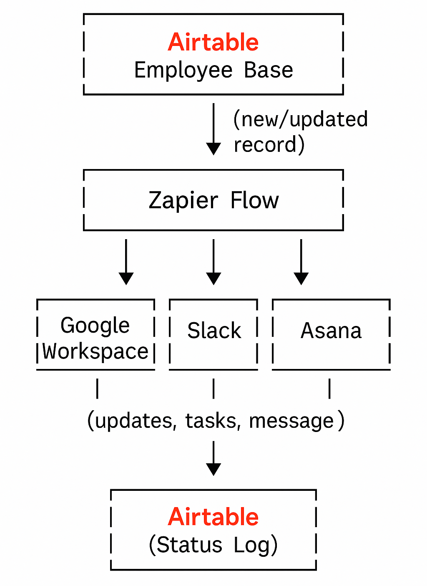

## Employee Onboarding & Offboarding Automation Lab

Showcasing integration skills with Google Workspace, Slack, Airtable, and Asana for modern employee lifecycle management.

---

## Table of Contents

- [Overview]
- [Airtable Employee Directory]
- [Automation Flow]
- [Zapier Workflow Steps]
- [Screenshots]
- [Diagram]
- [Permissions & Security]
- [Extra Capabilities]
- [About Me]

---

## Overview

This lab demonstrates how to automate onboarding and offboarding for employees using SaaS tools, focusing on user accounts, permissions, and integration best practices. All examples are based on real-world scenarios and implemented using no-code and low-code tools (Zapier/Make, native automations, APIs).

---

## Airtable Employee Directory

I use Airtable as the source of truth with the following fields:

| Name        | Email             | Role      | Manager   | Status        |
|-------------|-------------------|-----------|-----------|---------------|
| Jane Smith  | jane@company.com  | Engineer  | J. Brown  | Onboarding    |
| ...         | ...               | ...       | ...       | ...           |

- Status field (`Onboarding`, `Active`, `Offboarding`) drives automations.

---

## Automation Flow

- Onboarding: When a new employee row is added and Status = `Onboarding`, automation is triggered via Zapier.
  
- Actions:
1. Google Workspace: Create account (`first.last@company.com`), assign to correct group/OU.
2. Slack: Invite user, add to team channels, send personalized welcome DM.
3. Asana: Create onboarding project, assign tasks to new hire/manager.
4. Airtable: Update record with account details and onboarding progress.

- Offboarding: When HR updates Status = `Offboarding` in Airtable, automation triggers offboarding tasks.
  
- Actions:
1. Google Workspace: Suspend account, transfer docs to manager.
2. Slack: Deactivate user.
3. Asana: Reassign or close tasks/projects.
4. Airtable: Log offboarding date and reason.

---

## Zapier Workflow Steps

- Onboarding

1. Trigger: Airtable record Status = "Onboarding"
2. Google Workspace: Create user, assign group.
3. Slack: Invite user, add to channels, send DM.
4. Asana: Create onboarding project, assign tasks.
5. Airtable: Update with account info.

- Offboarding

1. Trigger: Airtable record Status = "Offboarding"
2. Google Workspace: Suspend user, transfer files.
3. Slack: Deactivate user.
4. Asana: Close/reassign tasks.
5. Airtable: Log offboarding date.

---

## Screenshots

*All relevant screenshots demonstrating each step are included in the screenshots/ folder of this repository.*

| Order | File Name                        | What it Shows                                                                                                   |
|-------|----------------------------------|-----------------------------------------------------------------------------------------------------------------|
| 1     | airtable-employee-directory.png  | Airtable Employee Directory with fields for Name, Email, Role, Manager, and Status, tracking onboarding status. |
| 2     | asana-onboarding-project.png     | Asana onboarding project listing new hire tasks, assignees, and due dates.                                      |
| 3     | google-workspace-admin.png       | Google Workspace Admin panel showing how to add a new user and assign organizational unit.                      |
| 4     | slack-welcome-message.png        | Example Slack direct message to a new hire with onboarding instructions and relevant channels.                  |
| 5     | zapier-onboarding-flow.png       | Zapier workflow (Zap) automating onboarding steps from Airtable to Google Workspace, Slack, and Asana.          |

## Screenshot Explanations

1. airtable-employee-directory.png: Displays the Airtable base used as the source of truth for all employees, including their current onboarding/offboarding status.

3. asana-onboarding-project.png: Shows an Asana project with a task list for onboarding a new hire, including assignments and due dates.

4. google-workspace-admin.png: Demonstrates the Google Workspace Admin panel used to create new employee accounts and assign them to the appropriate organizational unit.

5. slack-welcome-message.png: Example of a personalized Slack message sent to a new hire with onboarding steps and a welcome note.

6. zapier-onboarding-flow.png: Visualizes the Zapier automation workflow that connects Airtable with Google Workspace, Slack, and Asana to streamline onboarding.

---

## Diagram

---

## Permissions & Security

- Google Workspace: Role-based OUs/groups for granular permissions.  
- Slack: Channel access by team/role.  
- Airtable: Base access limited to HR/managers.  
- Asana: Projects shared with relevant team only.

---

## Extra Capabilities

- Device Assignment:
Airtable tracks laptops/devices issued to employees; flagged on offboarding for collection.

- Endpoint Security:
2FA enabled on Google Workspace and Slack by default; access revoked immediately on offboarding.

- IT Support:
#it-support Slack channel for day-to-day help; urgent tickets can trigger Asana task creation automatically.

- Security Training:
Automated reminders for phishing/security awareness can be assigned via Asana.

---

## About Me

I love automating business processes with modern SaaS tools and making work simpler for everyone. 
LinkedIn: https://www.linkedin.com/in/sebastiansilc/

Sebastian Silva C. - July, 2025 - Berlin, Germany
